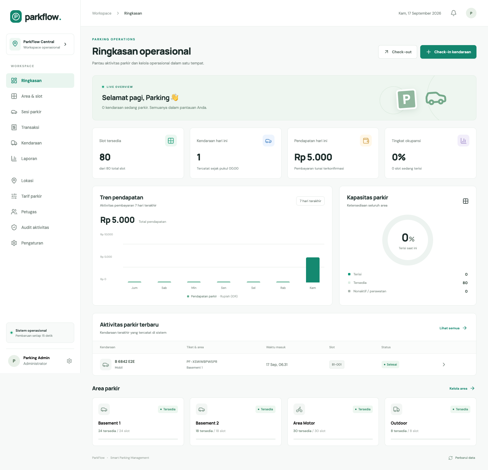

# ParkFlow

Sistem manajemen parkir berdasarkan **PRD Parking Management System.docx**, dengan antarmuka Bahasa Indonesia. Implementasi **MVP 1**: masuk kendaraan → slot otomatis → tiket QR → tarif otomatis → pembayaran tunai → keluar kendaraan → laporan.



## Jalankan di komputer ini

Aplikasi telah dipasang di `/Users/mymac/Downloads/parkflow`.

Buka **http://127.0.0.1:3000** saat server berjalan. Untuk menjalankan kembali, klik dua kali **Jalankan ParkFlow.command**, atau:

```bash
cd /Users/mymac/Downloads/parkflow
./scripts/start-local.sh
```

Biarkan Terminal terbuka. Tekan Ctrl+C untuk menghentikan kedua server. Bila port sedang dipakai oleh instance sebelumnya, buka URL aplikasi yang sudah aktif.

| Akun demo | Email | Kata sandi |
|---|---|---|
| Administrator | admin@parkflow.test | ParkFlow123! |
| Petugas | officer@parkflow.test | ParkFlow123! |

Database lokal SQLite sudah memiliki 1 lokasi, 4 area, 80 slot, dan tarif 5 jenis kendaraan. Transaksi dengan plat berakhiran `E2E` berasal dari pengujian browser. Data tersimpan setelah server dihentikan. Admin mengubah tarif/lokasi/slot; petugas mengoperasikan check-in/check-out. Ubah password di menu Pengaturan sebelum memakai data nyata.

## Instalasi baru

Prasyarat: PHP **8.5** dengan pdo_sqlite, mbstring, xml, intl; Composer 2; Node.js **22+**; npm. Versi aktual terkunci di `composer.lock` dan `package-lock.json`.

```bash
./scripts/setup-local.sh
./scripts/start-local.sh
```

Laravel di `127.0.0.1:8000`, Next.js di `127.0.0.1:3000`. Backend session cookie dan CSRF diproxy lewat origin frontend. SQLite digunakan agar demo lokal bisa berjalan tanpa Docker.

## Coba alur utama

1. Login admin. Menu **Lokasi** → tambah lokasi/area, atau gunakan slot bawaan.
2. Menu **Tarif parkir** → ubah tarif sesuai kebutuhan.
3. **Check-in kendaraan** → isi plat, jenis, area → buat tiket.
4. Cetak/simpan QR. Slot berubah menjadi terisi.
5. **Check-out** → cari plat/nomor tiket/token/URL QR → hitung tagihan.
6. Isi uang tunai, centang verifikasi kendaraan, lalu bayar. Struk menampilkan kembalian.
7. Slot tersedia kembali; lihat **Transaksi**, **Laporan**, dan **Audit aktivitas**.

Tarif minimal satu jam, tambahan jam dibulatkan ke atas, batas maksimum per blok 24 jam. Tarif tersimpan saat masuk; perubahan tarif tidak mengubah sesi aktif. Tiket hilang memakai denda sesuai snapshot. Pembayaran yang diulang dengan key sama menghasilkan transaksi yang sama.

## Docker: PostgreSQL + Redis

Aktifkan Docker Desktop, lalu:

```bash
cp .env.example .env
php -r 'echo "base64:".base64_encode(random_bytes(32)).PHP_EOL;'
# Isi APP_KEY dengan hasil perintah tersebut dan ganti DB_PASSWORD di .env.
docker compose up --build -d
```

Buka **http://localhost:8080**. Service: frontend, backend PHP-FPM, PostgreSQL, Redis, init migration/seed, worker, Nginx. Data disimpan di Docker volumes. `DEMO_SEED=true` mengaktifkan akun/slot demo. Worker tersedia sebagai fondasi V2, belum digunakan oleh workflow tunai MVP.

Untuk deployment nyata: konfigurasi TLS reverse proxy, `APP_URL` HTTPS, `SESSION_SECURE_COOKIE=true`, kredensial unik, `DEMO_SEED=false`, akun operasional yang dikelola sendiri, backup dan monitoring. Compose hanya menerbitkan port loopback untuk penggunaan lokal. Docker runtime belum diuji pada sesi implementasi karena daemon belum aktif; validasi Compose berhasil.

## Pengujian

```bash
cd backend
php artisan test
vendor/bin/pint --test
cd ../frontend
npm run build
node tests/smoke.cjs
```

Smoke test membutuhkan dua server lokal berjalan. macOS memakai Google Chrome yang terpasang; OS lain gunakan `npx playwright install chromium`, atau tentukan `CHROME_PATH`. Smoke test membuat satu sesi dan pembayaran tunai nyata di database demo, dengan akhiran plat E2E.

Hasil dan batas pengujian: [docs/TESTING.md](docs/TESTING.md).

## Struktur

- `frontend/`: Next.js, React, TypeScript, CSS responsif, QR generator.
- `backend/`: Laravel REST API, transaksi DB, session auth, migrations, tests.
- `compose.yaml`, `infrastructure/`: PostgreSQL/Redis/PHP-FPM/Next.js/Nginx.
- `.github/workflows/ci.yml`: tes backend, Pint, build frontend dan image Docker.
- [Arsitektur & ERD](docs/ARCHITECTURE.md), [Dokumentasi API](docs/API.md), [Cakupan & roadmap](docs/ROADMAP.md).

Frontend menggunakan CSS langsung dan fetch React; TanStack Query, React Hook Form, Zod, dan Tailwind rekomendasi PRD belum digunakan. Tidak ada transaksi/grafik simulasi di UI. Data berasal dari Laravel. Grafik diperbarui dengan polling 15 detik, belum WebSocket.

Reservasi, membership, payment gateway, shift, email, serta IoT adalah roadmap V2/V3. Ekspor CSV dan print PDF tersedia; XLSX/PDF server-side belum. Belum dipublikasikan ke GitHub/hosting dan belum menjalankan load test 100/500/1000 concurrent users. Baca roadmap untuk pemetaan lengkap.

Referensi implementasi: [Next.js installation](https://nextjs.org/docs/app/getting-started/installation), [Laravel query builder / locking](https://laravel.com/framework/docs/13.x/queries).
