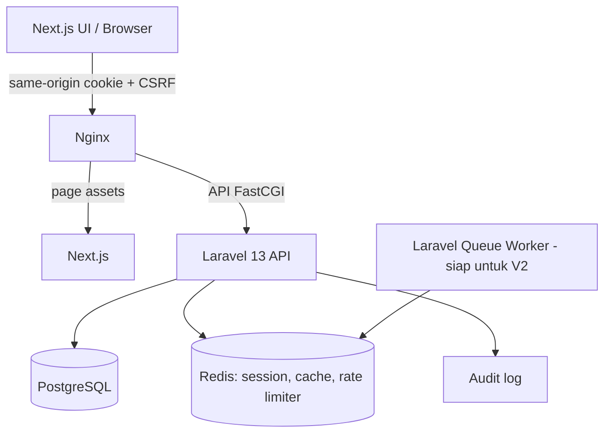
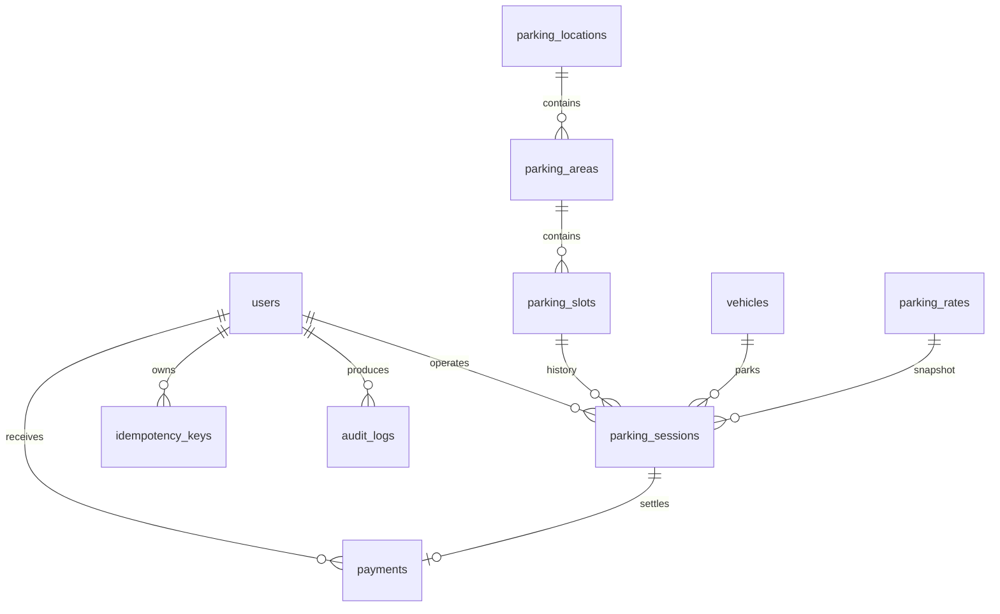

# Arsitektur ParkFlow

Pengembangan lokal: Next.js mem-proxy `/api/*` ke Laravel di port 8000; SQLite menyimpan data. Docker: Nginx merutekan `/api/*` langsung ke PHP-FPM, halaman ke Next.js; PostgreSQL menjadi database utama. Timezone bisnis adalah Asia/Jakarta.

## ERD

Rate snapshot merupakan salinan JSON immutable per sesi, bukan foreign key. Tiket disimpan bersama sesi (`ticket_number`, `ticket_token`) pada MVP.

## Konsistensi transaksi

- Check-in: kunci baris user untuk idempotency → kunci area → upsert kendaraan → kunci kendaraan → periksa sesi aktif → kunci slot tersedia → buat sesi/tiket → tandai slot OCCUPIED → catat audit + respons idempotency → commit.
- Unique constraints `active_plate` dan `active_slot` menjadi lapisan perlindungan tambahan. Keduanya di-set null ketika sesi selesai. PostgreSQL mengizinkan banyak nilai null pada unique index.
- Check-out: kunci user → baca respons idempotency bila ada → kunci sesi aktif → hitung ulang tarif → validasi total yang disetujui dan uang diterima → buat pembayaran → tutup sesi → kosongkan slot → catat audit → commit.
- Key bersifat per-user dan divalidasi terhadap hash endpoint + payload. Key sama dengan payload berbeda mendapat HTTP 409. Key berbeda pada kendaraan/sesi yang sudah diproses juga tidak membuat transaksi ganda.
- Snapshot tarif memastikan perubahan konfigurasi tidak mengubah tagihan sesi aktif. Tarif minimum satu jam, pembulatan ke atas, batas tarif per blok 24 jam; denda hanya sekali saat tiket hilang.
- Jika durasi melewati batas jam setelah quote, backend memberi 409. Petugas menghitung ulang sebelum menyetujui pembayaran.
- SQLite cocok untuk pengembangan dan pengujian fungsional. Jaminan row locking bersamaan perlu diuji di PostgreSQL; pengujian lokal berurutan bukan bukti load/concurrency production.

## Keamanan

Password di-hash Laravel; login memakai session HttpOnly, regenerasi session, CSRF, pembatasan login per email+IP serta per endpoint. Role operasional ditolak secara default kecuali admin/super_admin/officer. Mutasi konfigurasi, laporan, petugas, dan audit memerlukan admin di backend. Token tiket 256-bit acak hanya mengidentifikasi sesi; endpoint publik menampilkan subset data tiket tanpa data petugas/pembayaran internal. Header no-store untuk API; no-referrer mencegah URL tiket dibagikan melalui header referer. HTTPS dan secure cookie perlu diaktifkan saat deployment di balik TLS.

## Batas MVP

Polling 15 detik, belum WebSocket/SSE. Pembayaran tunai saja dan transaksi atomik, belum provider/webhook. Role statis admin/officer, belum editor permission granular dan scoped location per petugas. Worker disiapkan tetapi belum ada job V2. Dashboard tidak di-cache agar hasil transaksi langsung konsisten. Data tiket adalah bearer link: siapa pun yang memiliki URL dapat melihat tiket tersebut.
